---
title-slide-attributes:
- data-background-image: /assets/intro.jpg
- data-background-size: cover
- data-background-opacity: 0.18
- data-background-color: aquamarine
title: Una propuesta de evaluación cualitativa 
subtitle: Y su relación con la práctica de aula
author: <a href="www.tierradenumeros.com">Pablo Beltrán-Pellicer </a>   CPI Val de la Atalaya (María de Huerva, Zaragoza), Universidad de Zaragoza     Charla-taller en el IES Tiempos Modernos, Zaragoza    24 de noviembre de 2020   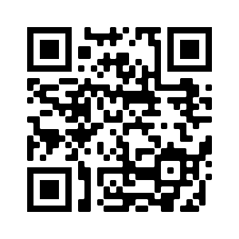    <a href="https://pbeltran.github.io/2020-tiempos-evaluacion">https://pbeltran.github.io/2020-tiempos-evaluacion</a>    
rollingLinks: true
description: Materiales distribuidos bajo licencia CC-BY-SA-4.0 

---

# Introducción {data-background-image="assets/intro.jpg" data-background-opacity="0.22"}

## La evaluación como calificación o la calificación como evaluación

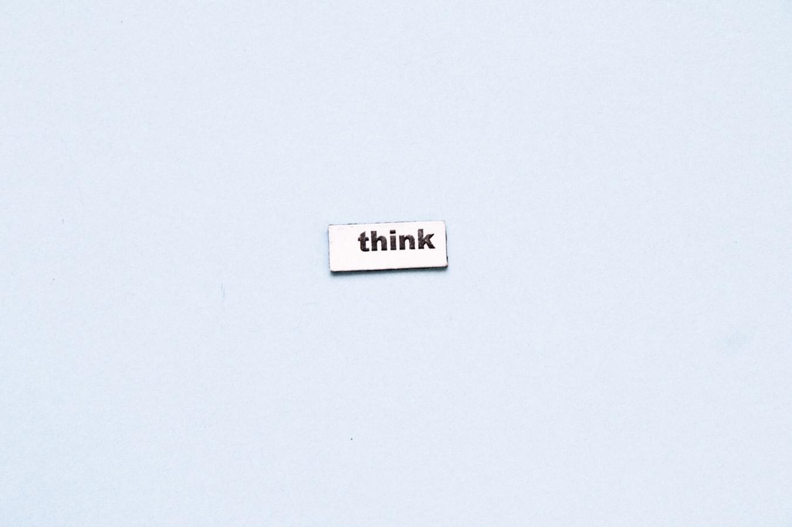{width=60%}

##

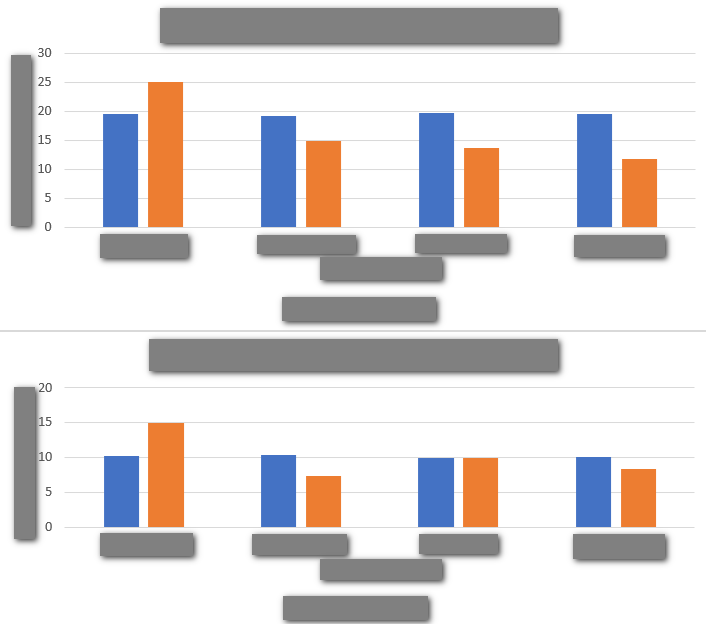{width=60%}

Sin hacer spoiler, no avances de diapositiva en diapositiva hasta que hayas pensado qué pueden significar las etiquetas que faltan. ¿Qué observas?

##

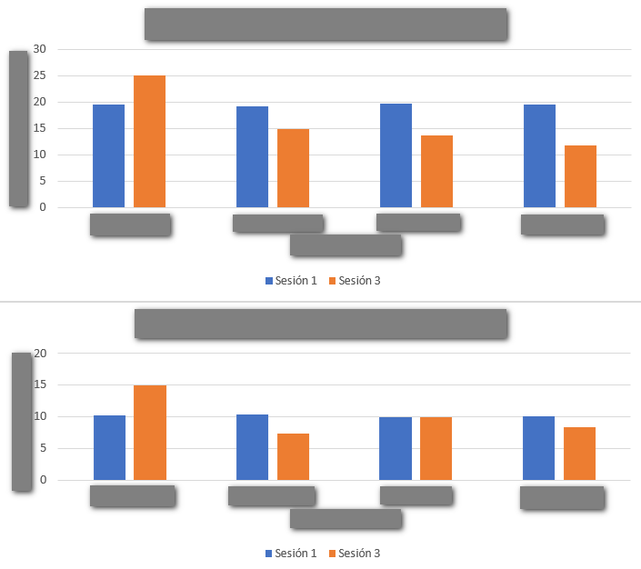{width=80%}

##

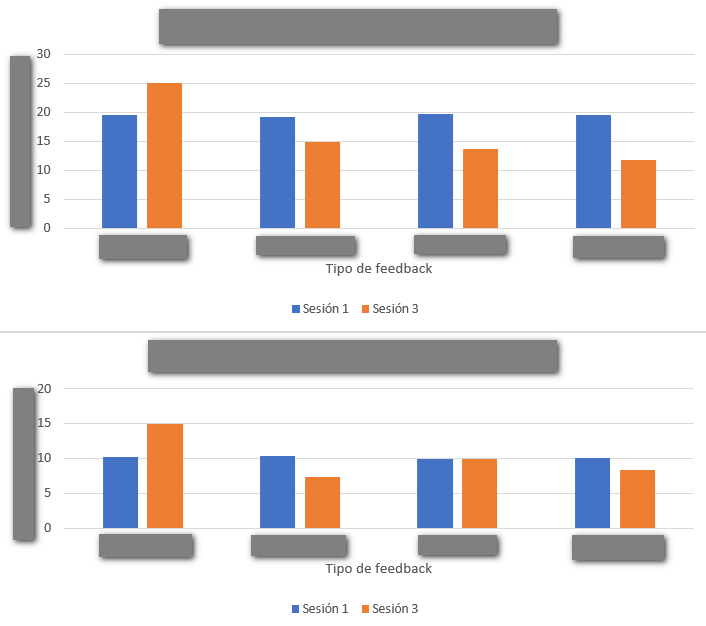{width=80%}

##

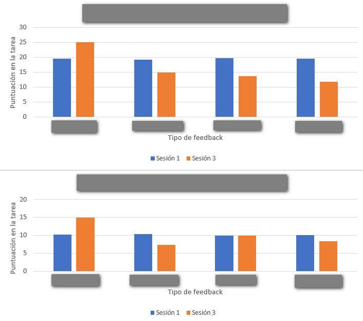{width=80%}

##

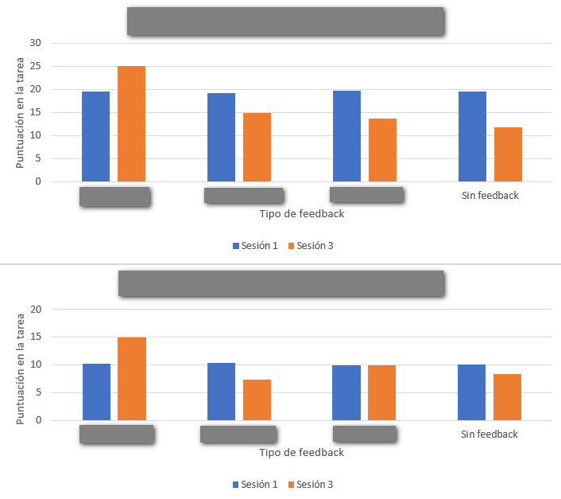{width=80%}

##

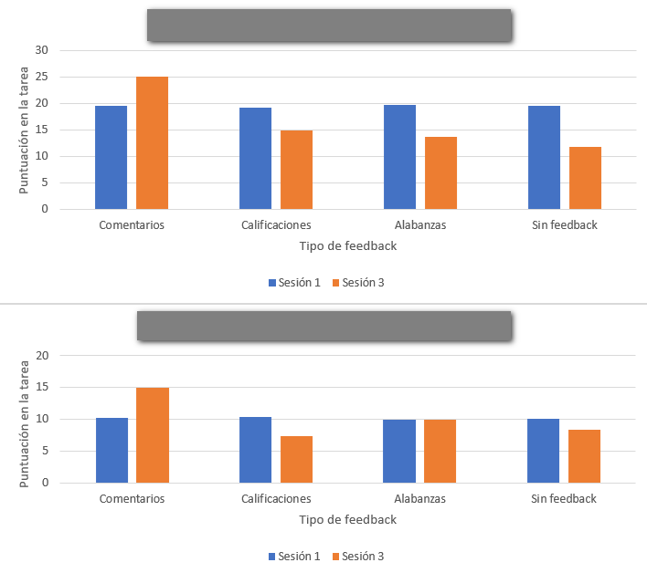{width=80%}

##

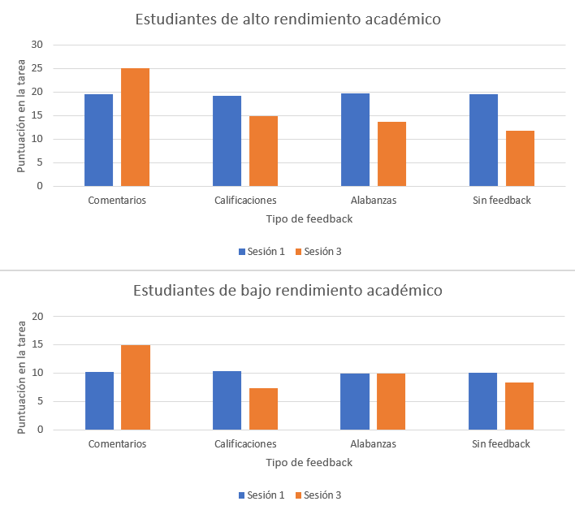{width=80%}

## La evaluación como algo objetivo

{width=60%}

## A mí eso no me pasa, soy justo y objetivo

> Dada la función $f(x)=\cfrac{x^2}{4-x}$ , calcula sus extremos relativos.

Arnal-Bailera, Muñoz-Escolano, & Oller-Marcén (2016) dieron a calificar tres respuestas a una muestra de 91 profesores, de forma que:

- Los métodos aparecen en libros de texto y los dos primeros son muy utilizados por estudiantes en las PAU.
- No presentan ninguna incorrección matemática manifiesta.
- En las tres respuestas se obtiene la solución correcta.
- El nivel de argumentación de las tres respuestas es similar.

## Método 1

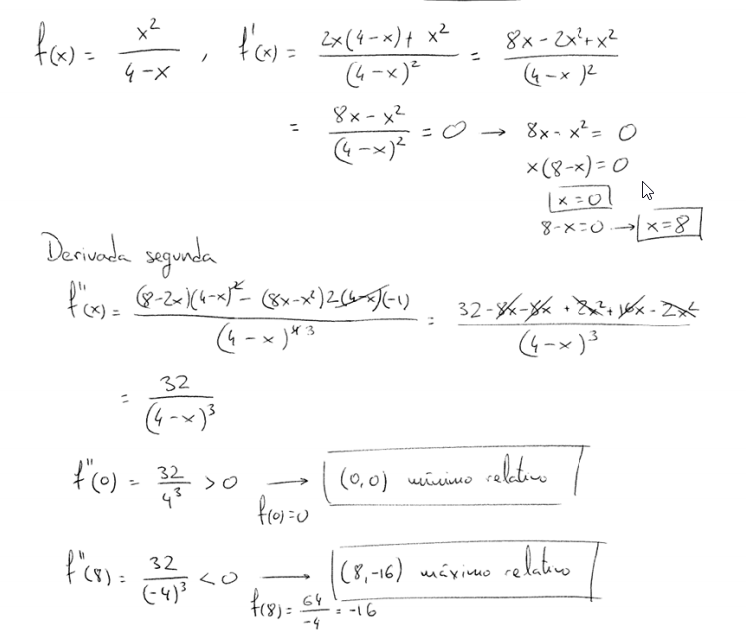{width=65%}

Fuente: Arnal-Bailera, Muñoz-Escolano, & Oller-Marcén (2016)

## Método 2

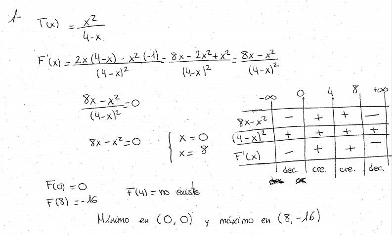{width=65%}

Fuente: Arnal-Bailera, Muñoz-Escolano, & Oller-Marcén (2016)

## Método 3
 
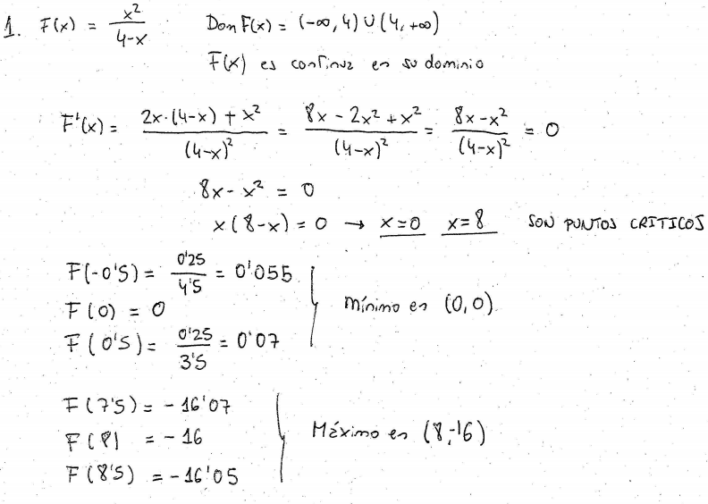{width=65%}

Fuente: Arnal-Bailera, Muñoz-Escolano, & Oller-Marcén (2016)

## Muestra

> Compuesta por 91 profesores de matemáticas (en ejercicio y en formación)

- 26 profesores en formación que cursaron el Máster del Profesorado (Matemáticas).
- 45 profesores de ESO y Bachillerato de 14 centros educativos aragoneses y con diferentes años de experiencia.
- 20 profesores de universidad, matemáticos de formación que imparten o han impartido clase en licenciaturas y grados de matemáticas.

## Resultados

- Conglomerado 1. Puntúan bajo el método 2 y el método 3. Solamente dan por totalmente correcto el método 1.
- Conglomerado 2. Puntúan alto los tres métodos propuestos. Concentra algo más de la mitad de los profesores que respondieron el cuestionario.
- Conglomerado 3. Puntúan bajo el método 3 y puntúan alto los métodos 1 y 2. Reúne la tercera parte de los profesores que respondieron el cuestionario.

##

- No se observan diferencias estadísticamente significativas entre las calificaciones otorgadas por los distintos colectivos para el método 1.
- Respecto al método 2, se puede afirmar (nivel de confianza del 99%) que el profesorado de universidad otorga una calificación mayor que los
profesores en formación. Aunque la nota media otorgada por el profesorado de ESO también es mayor que la de los profesores en formación, esta diferencia no resulta ser significativa. No hay diferencias entre el profesorado de ESO y el de Universidad. 
- En cuanto al método 3, el profesorado de universidad otorga calificaciones mayores (nivel de confianza del 95%) que los otros dos colectivos. Los profesores
en formación otorgan mayores calificaciones (nivel de confianza del 90%) que el profesorado de ESO.
- Pobre fiabilidad interjueces.

## En los profesores de secundaria
Tres grupos de profesores en base a sus comentarios:

la argumentación empleada
por el alumno, la corrección matemática de la respuesta y la concordancia
entre el método empleado y el esperado. 

El primero de ellos se
caracteriza por una elevada exigencia de argumentación y proporciona
las calificaciones globalmente más bajas. El segundo, aunque considera
adecuadas la argumentación y la corrección matemática de los tres
métodos, muestra un ligero sesgo en contra de la respuesta del método
3. El tercero se caracteriza por una clara penalización a la respuesta del
método 3, otorgando las calificaciones más altas a las otras dos
respuestas.

## Conclusiones del estudio

- Alta variabilidad entre las calificaciones otorgadas por los profesores, principalmente en los métodos 2 y 3. 
- Fiabilidad interjueces también es baja tanto globalmente como para cada uno de los estratos.

- La pertenencia a un colectivo u otro (y por tanto la formación académica) influye a la hora de calificar las tareas siendo el colectivo de profesores
en formación el que presenta una mayor dispersión de calificaciones y apunta al hecho de que es necesaria formación específica sobre este aspecto, como ya señalaban otros estudios (Huitrado y Climent, 2013;
Mollà, 1997). 

- Sin embargo, en cuanto a los años de experiencia docente en Secundaria, aunque se aprecian diferencias entre las medias de cada conglomerado, estas no han resultado ser estadísticamente significativas.

- Los resultados parecen apuntar que con muestras más grandes, se podría apreciar una mayor concentración de profesores con mayor experiencia en el conglomerado 1 respecto al conglomerado 3.

- Estas conclusiones están parcialmente en la línea de otros estudios anteriores (Meier et ál., 2006; Wang y Cai, 2006) que señalaban el conocimiento matemático y la experiencia docente como factores intervinientes en la variabilidad de las calificaciones entre correctores.

- La calificación otorgada por gran parte de los correctores es mayor cuando se utilizan métodos más cercanos al modo de hacer y a la experiencia docente del corrector. Esta conclusión va en la línea de Espinosa (2005) y Fernández et ál. (2014). 

- Sin embargo, un análisis cualitativo detallado de las actuaciones de estos correctores demuestra que en muchos casos no hacen explícita esta preferencia y ofrecen distintas justificaciones
- Algunos correctores señalan que el método elegido no es “matemáticamente correcto” lo cual no es cierto y apuntaría a un déficit de conocimiento matemático por parte del corrector. 
- Otros, aun admitiendo la corrección y la adecuación del método, exigen una mayor argumentación en la respuesta que no suele ser exigida cuando otro estudiante opta por un método esperado por el corrector.

- Dentro del colectivo de Profesores de Secundaria, tres grupos de profesores en base a sus comentarios respecto a tres categorías: la argumentación empleada
por el alumno, la corrección matemática de la respuesta y la concordancia entre el método empleado y el esperado. El primero de ellos se caracteriza por una elevada exigencia de argumentación y proporciona las calificaciones globalmente más bajas. El segundo, aunque considera adecuadas la argumentación y la corrección matemática de los tres métodos, muestra un ligero sesgo en contra de la respuesta del método 3. El tercero se caracteriza por una clara penalización a la respuesta del método 3, otorgando las calificaciones más altas a las otras dos respuestas

# A través {data-background-image="assets/clase.jpg" data-background-opacity="0.18"}

## Empezamos con situaciones-problema {data-background-image="assets/clase.jpg" data-background-opacity="0.12"}

:::incremental
1. Laura se llevó sus cromos al colegio para jugar varias partidas. En la primera perdió 9 cromos y en la segunda ganó 7 cromos. ¿Cuántos cromos le quedaron después de jugar?
2. Un tren sale de Zaragoza con cierto número de pasajeros y llega a Barcelona después de hacer dos paradas. En la primera parada, bajan 15 y suben 12 pasajeros; en la segunda parada, bajan 38 y suben 42 pasajeros. ¿Con cuántos pasajeros llegó el tren a Barcelona?
:::

##

3. Completa las tablas siguientes sobre el número de pasajeros del tren anterior

| Número de pasajeros que sale de Zaragoza 	| Número de pasajeros que llega a Barcelona 	|
|:----------------------------------------:	|:-----------------------------------------:	|
| 427                                      	|                                           	|
| 1582                                     	|                                           	|
| a                                        	|                                           	|

##

| Número de pasajeros que sale de Zaragoza 	| Número de pasajeros que llega a Barcelona 	|
|:----------------------------------------:	|:-----------------------------------------:	|
|                                          	|                     45                    	|
|                                          	|                    876                    	|
|                                          	|                     c                     	|

Fuente: Cid (2015)

## ¿Qué es enseñar a través de la resolución de problemas? {data-background-image="assets/clase.jpg" data-background-opacity="0.12"}

:::::::::::::: {.columns}

::: {.column width="25%"}

{width=100%}

:::

::: {.column width="70%"}

- Sintetizando mucho, este enfoque consiste en utilizar problemas (en sentido amplio, tareas o situaciones-problema) de los que emerge el contenido matemático. 
- Mediante el trabajo en pequeños grupos y las posteriores puestas en común, el docente proporciona un andamiaje para profundizar en dichos contenidos, siempre a partir de los significados personales del alumnado.

:::

::::::::::::::

## ¿Qué es enseñar a través de la resolución de problemas? {data-background-image="assets/clase.jpg" data-background-opacity="0.12"}

:::::::::::::: {.columns}

::: {.column width="45%"}

{width=100%}

:::

::: {.column width="45%"}

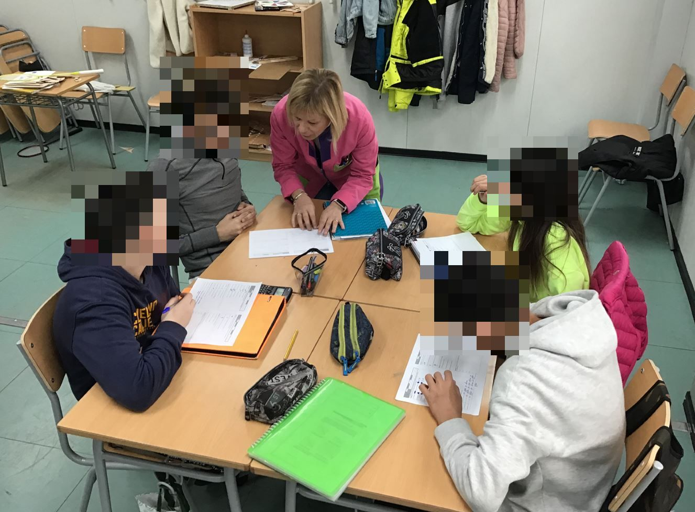{width=100%}

:::

::::::::::::::

## Nuestra preocupación y la estrategia seguida {data-background-image="assets/clase.jpg" data-background-opacity="0.12"}

> ¿Cómo mantener activo al alumnado? ¿Cómo seguir trabajando la capacidad de indagación? ¿Cómo seguir desarrollando esa **actitud matemática**?

- Agrupación por nivel. 
	- Una clase virtual para todo 1º ESO y otra clase virtual para todo 2º ESO.
	- Oportunidad para la codocencia.

## Nuestra preocupación y la estrategia seguida {data-background-image="assets/clase.jpg" data-background-opacity="0.12"}

- Una videoconferencia conjunta para planificar una semana de trabajo y otra para discutir las producciones que habían enviado los alumnos y preparar la puesta en común.
- Puestas en común: se reservaron los jueves como día para una videoconferencia donde se interactuaba con los alumnos. 
- Tareas semanales y autoevaluaciones. Después de cada videoconferencia, los alumnos hacían reentrega final de lo ya hecho, y recibían nuevas tareas, entre ellas, completar la autoevaluación. 

# Criterios de observación {data-background-image="assets/observation.jpg" data-background-opacity="0.22"}

## Producciones del alumnado {data-background-image="assets/observation.jpg" data-background-opacity="0.12"}

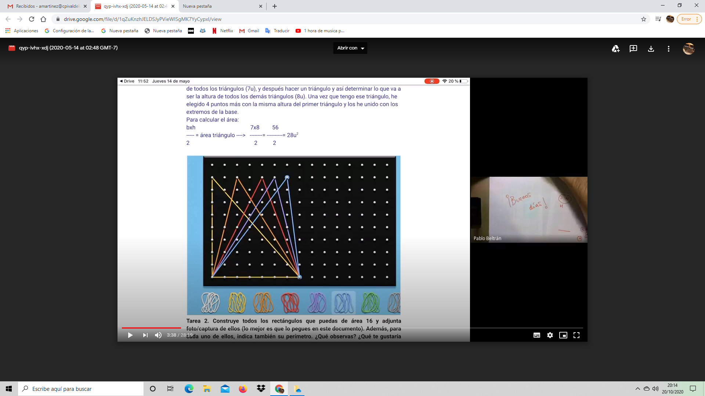{width=100%}

## Atención a la diversidad {data-background-image="assets/observation.jpg" data-background-opacity="0.12"}

En una de las actividades, se trata de averiguar el circuncentro de algunos cuadriláteros: cuadrado, rectángulo, trapecio isósceles, trapecio rectángulo.

El del trapecio rectángulo no se puede hacer, claro, si trazas las mediatrices no se cortan en el mismo punto. 
Una alumna realizó la siguiente observación:

{width=80%}

## Atención a la diversidad {data-background-image="assets/observation.jpg" data-background-opacity="0.12"}

En clase presencial puedes animar a los alumnos a realizar este tipo de observaciones, eligiendo bien las preguntas. Por eso nos alegramos de ver esto en formato online. Le preguntamos que cómo podía estar segura de lo que decía y que se animara a utilizar las herramientas de geogebra.

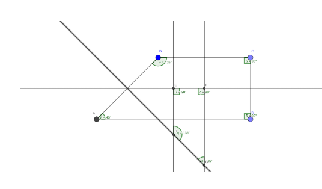{width=50%}

Después, le propusimos pensar acerca del porqué de que ocurra, que implica propiedades de la mediatriz y de ángulos, así como aspectos de perpendicularidad y semejanza.

## Las autoevaluaciones, el eje de la práctica {data-background-image="assets/observation.jpg" data-background-opacity="0.12"}

1. Necesito más tiempo para entender esto o necesito un ejemplo delante para poder hacerlo
2. Puedo hacer esto por mi cuenta, pero hay cosas que no entiendo, me falta una explicación y/o estoy cometiendo errores de cálculo.
3. Puedo hacer esto por mi cuenta sin errores y explicar o mostrar cómo lo resolví.
4. Puedo hacer esto por mi cuenta sin errores, explicar o mostrar cómo lo resolví, y explicar qué significa mi solución o hacer alguna observación adicional. 

> Además, tenían que escribir un párrafo donde describían sus dificultades; otro, con lo que aprendieron; y otro, con lo que les gustaría aprender. La autoevaluación **tenía que estar completa**, si no, se devolvía al alumno. 

## Autoevaluaciones: percepción del alumnado {data-background-image="assets/observation.jpg" data-background-opacity="0.12"}

> Esto son dos ejemplos de autoevaluación.

:::::::::::::: {.columns}

::: {.column width="45%"}

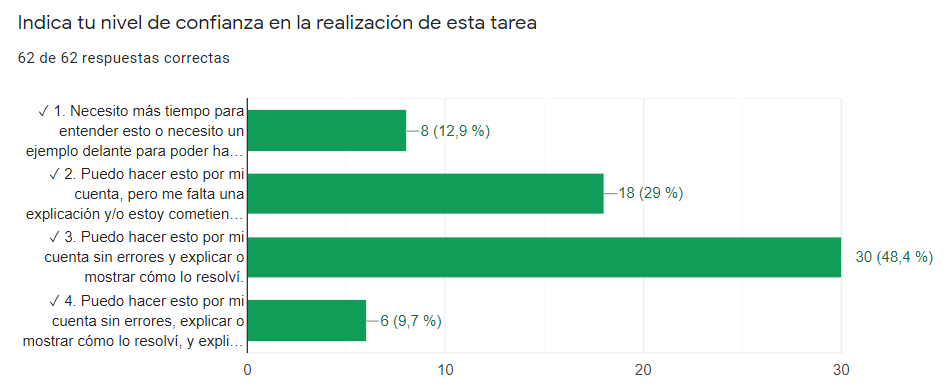{width=100%}

Tarea: Escaleras, super figuras y formas por formas

:::

::: {.column width="45%"}

{width=100%}

Tarea: Pero...¿qué es un cuadrado? (sobre definiciones)

:::

::::::::::::::

## Autoevaluaciones: dificultades {data-background-image="assets/observation.jpg" data-background-opacity="0.12"}

{width=100%}

## Autoevaluaciones: ¿qué he aprendido? {data-background-image="assets/observation.jpg" data-background-opacity="0.12"}

{width=100%}

## Autoevaluaciones: ¿Qué me gustaría aprender? {data-background-image="assets/observation.jpg" data-background-opacity="0.12"}

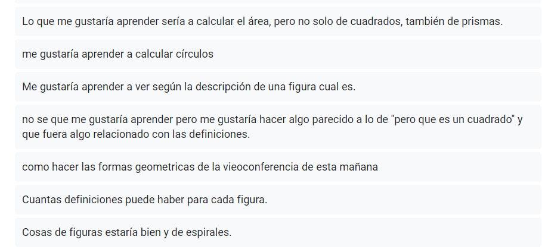{width=100%}

## Encuesta final: forma de trabajar {data-background-image="assets/observation.jpg" data-background-opacity="0.12"}

Algunas respuestas del alumnado

:::::::::::::: {.columns}

::: {.column width="45%"}

> Antes de marzo

- Trabajábamos en grupos y así nos podíamos ayudar entre nosotros, y también las dudas que se habían planteado varias veces, se discutían con toda la clase.
- A mi me gustaba mucho porque lo hacíamos todo en equipo y era la única clase que compartíamos nuestra opinión con nuestros compañeros

:::

::: {.column width="45%"}

> Después de marzo

- Se ha intentado hacer como en clase, que sea interactivo y que nos hiciera pensar pero el trabajo ha sido más individual
- Parecido a clase pero más entretenido al usar aplicaciones
- Parecido a lo que hacíamos en clase pero en lugar de comentarlo en grupo, lo teníamos que hacer solos, intentando llegar a las soluciones poco a poco.

:::

::::::::::::::

# Retos y dificultades {data-background-image="assets/retos.jpg" data-background-opacity="0.22"}

## Retos y dificultades {data-background-image="assets/retos.jpg" data-background-opacity="0.12"}
 
- Menor interacción.
- Atención a la diversidad. 
- Pérdida de control del grado de ayuda que reciben en casa.

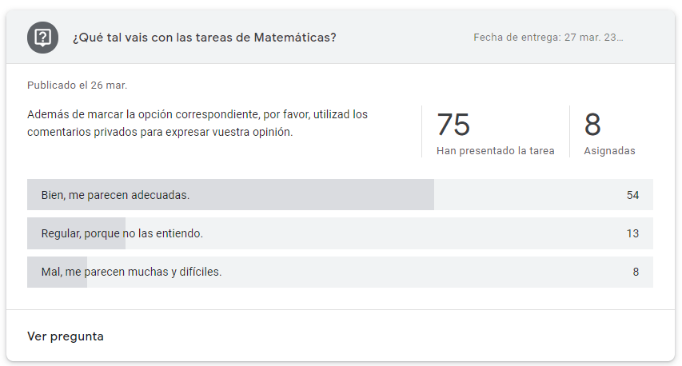{width=80%}

# Procesos de validación e impacto educativo generado {data-background-image="assets/horizon.jpg" data-background-opacity="0.22"}

## Niveles de interacción ahora {data-background-image="assets/horizon.jpg" data-background-opacity="0.12"}

> Queda pendiente analizar el impacto educativo. Hasta ahora, la percepción es que este alumnado interactúa y presenta una actitud más proactiva ahora que a principios del curso pasado. 

- Ahora es imposible trabajar en mesas enfrentadas y/o agrupadas, por lo que hay que interactuar a distancia. 
- Parejas o grupos de cuatro alumnos, tal y como están sentados habitualmente.
- Ayuda de una pizarrita blanca para enseñar lo que se está haciendo.

. . .

{width=30%}

# Créditos y referencias {data-background-image="assets/credits.jpg" data-background-opacity="0.1"}

## Lista de referencias {data-background-image="assets/credits.jpg" data-background-opacity="0.1"}

Arnal-Bailera, A., Muñoz-Escolano, J. M., & Oller-Marcén, A. M. (2016). Caracterización de las actuaciones de correctores al calificar pruebas escritas de matemáticas. *Revista de Educación, 371*, 35-60.[Enlace](http://www.educacionyfp.gob.es/dam/jcr:0ceb64aa-a0cc-4424-92b6-543f068d0923/revista-371-esp-pdf.pdf#page=35)

Burnett, A. (2019). How to Create a Gradeless Math Classroom in a School That Requires Grades. [Entrada de blog]. [Enlace](https://burnettmath.wordpress.com/2019/07/17/how-to-create-a-gradeless-math-classroom-in-a-school-that-requires-grades-updated-from-original-post/)

Butler, R. (1987). Task-Involving and Ego-Involving Properties of Evaluation: Effects of Different Feedback Conditions on Motivational Perceptions, Interest, and Performance. *Journal of Educational Psychology, 79*(4), 474–482. 

Butler, R. (1988). Enhancing and undermining intrinsic motivation. *British Journal of Educational Psychology, 58*(1), 1-14. 

Cai, J. (2003). What research tells us about teaching mathematics through problem solving. Research and issues in teaching mathematics through problem solving, 241-254.

English, L. D., & Gainsburg, J. (2016). Problem Solving in a 21st-Century Mathematics Curriculum. En L.D. English, & D. Kirshner, *Handbook of international research in mathematics education* (p. 326). New York: Routledge.

Gaulin, C. (2001). Tendencias actuales de la resolución de problemas. _Sigma, 19_, 51-63. [Enlace](http://www.hezkuntza.ejgv.euskadi.eus/r43-573/es/contenidos/informacion/dia6_sigma/es_sigma/adjuntos/sigma_19/7_Tendencias_Actuales.pdf)

## Créditos {data-background-image="assets/credits.jpg" data-background-opacity="0.1"}

*Compartir el conocimiento de forma libre es una buena práctica.*

En estas diapositivas se han utilizado materiales disponibles en abierto y se han citado las fuentes correspondientes. El contenido de la presentación está publicado con licencia Creative Common [CC-BY-SA-4.0](https://creativecommons.org/licenses/by-sa/4.0/legalcode.es), lo que quiere decir que puedes compartirla y adaptarla, citándola y poniendo un enlace a la presentación.

> Siéntete libre de trabajar con este material y de contactar para compartir tus reflexiones.

## {data-background-image="assets/credits.jpg" data-background-opacity="0.1"}

Presentación realizada con  <a href="https://revealjs.com/#/">Reveal.js</a>, <a href="https://pandoc.org/">Pandoc</a>, <a href="https://www.mathjax.org/">MathJax</a> y <a href="https://www.markdownguide.org/">Markdown</a>. El código fuente está disponible en [https://github.com/pbeltran](https://github.com/pbeltran/)

La fuente de las imágenes es propia, salvo las que se ha citado la fuente en su diapositiva y las de dominio público obtenidas en [Unsplash](https://unsplash.com).

